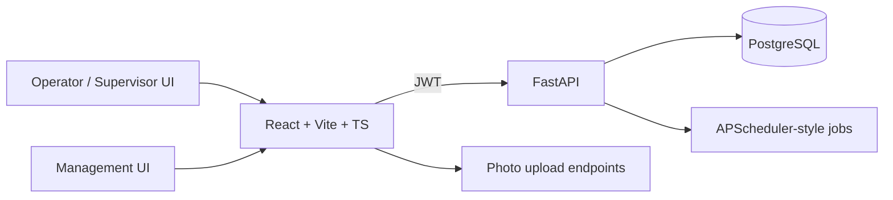

# Maintain — plant maintenance & cleaning tracker

Internal operations app for Kuberpack’s Sonipat plant: schedule and complete machine cleaning/PM checklists, capture photo proof, escalate exceptions for supervisor review, and report overdue work.

## Problem

Corrugation and converting lines need recurring cleaning, oiling, and preventive checks. Paper checklists go missing, exceptions are verbal, and management lacks a live view of overdue or critical items. Maintain replaces that with roleled workflows (operator / supervisor / management), photo evidence, and review gates before a run counts as done.

## Features

- Role-based auth: phone + PIN for operators/supervisors; email + password for management
- Machine registry with task types (cleaning, oiling, part replacement, repair, preventive)
- Checklist items with optional numeric readings and min/max bands
- Task instances with due dates, overdue tracking, photo + exception photo requirements
- Supervisor review workflow (`awaiting_review` → approved/rejected) before recurrence advances
- Handover notes per machine across shifts
- Repair logs and part replacement records
- Weekly/summary reporting views
- Seed script for 18 plant machines + demo users; separate bootstrap for first real admin
- Docker Compose (API, frontend, Postgres); Alembic migrations
- Backup script (`scripts/backup.sh`) with retention pruning
- Production notes in `DEPLOYMENT.md` (Vercel frontend + Railway backend pattern)

## Architecture



Data model centrepiece is `task_instances` joined to `task_types` / `checklist_items` / `checklist_item_results`. Work is not `done` until `review_status=approved`; only then is the next recurring instance created. See `schema.md` and `architecture.md` for column-level detail.

## Tech stack

| Layer | Choice |
|---|---|
| Backend | FastAPI, SQLAlchemy, Alembic, PostgreSQL |
| Frontend | React + TypeScript (Vite), Tailwind CSS |
| Auth | JWT sessions (dual credential styles by role) |
| Alerts | WhatsApp + email hooks stubbed pending BSP choice |
| Ops | Docker Compose, `pg_dump` backup script |

## Key engineering decisions

1. **Review gate before recurrence.** Prevents rubber-stamp completions from advancing the schedule; supervisors must approve.
2. **Photo proof + exception photos.** Critical/attention items require extra evidence.
3. **Fast-submit heuristic.** Large checklists completed unrealistically quickly are flagged (`is_fast_submit`) for scrutiny.
4. **Seed vs bootstrap.** `seed.py` wipes and loads demo plant data — never against live floor history. `bootstrap_account.py` creates a single real admin/supervisor without touching machines.
5. **Host-side backups.** `backup.sh` runs on the host against published Postgres `5432`, independent of container lifecycle.

## Getting started

### Prerequisites

- Docker + Compose, or local Python 3.11+ / Node 20+ and Postgres

### Docker Compose

```bash
git clone https://github.com/Kuberpack/maintain.git
cd maintain
cp .env.example .env
cp backend/.env.example backend/.env
cp frontend/.env.example frontend/.env
docker compose up --build
```

Then migrate and seed (empty DB on first boot):

```bash
docker compose exec backend alembic upgrade head
docker compose exec backend python -m app.seed
```

- Backend: http://localhost:8000 (`/health` is a DB ping only)
- Frontend: http://localhost:5173

### Environment variables (names)

Root / backend / frontend `.env.example` files list names such as:

- `DATABASE_URL`, `POSTGRES_USER`, `POSTGRES_PASSWORD`, `POSTGRES_DB`
- JWT / secret settings used by the API
- `VITE_API_URL` (or equivalent) for the frontend
- `BACKUP_RETENTION_DAYS` for the backup script

Never commit filled `.env` files.

### Demo logins (seed only)

Dummy plant users are documented in the seed output / prior README table (operators on phone+PIN, one management email). Change all credentials before any shared deployment.

### First real account (no wipe)

```bash
docker compose exec backend python -m app.bootstrap_account
```

### Backups

```bash
./scripts/backup.sh
# restore example:
# gunzip -c backups/maintain_YYYYMMDD_HHMMSS.sql.gz | psql -h localhost -U maintain -d maintain
```

## Project structure

```
maintain/
├── backend/app/
│   ├── routers/       # auth, machines, tasks, reviews, reports, …
│   ├── models.py
│   ├── scheduler.py
│   ├── seed.py
│   └── bootstrap_account.py
├── backend/alembic/
├── frontend/src/
│   ├── pages/         # Today, Overdue, Review, Reports, Users, …
│   ├── auth/
│   └── api/
├── scripts/backup.sh
├── docker-compose.yml
├── DEPLOYMENT.md
├── architecture.md
└── schema.md
```

## Testing / quality

No dedicated CI test suite is required to run the app locally; validate via `/health`, login, and completing a checklist through review. Prefer adding API tests around review transitions and recurrence creation before expanding plant rollout.

## Deployment

See `DEPLOYMENT.md` for the Vercel + Railway (or equivalent) split, env wiring, and migration order.
